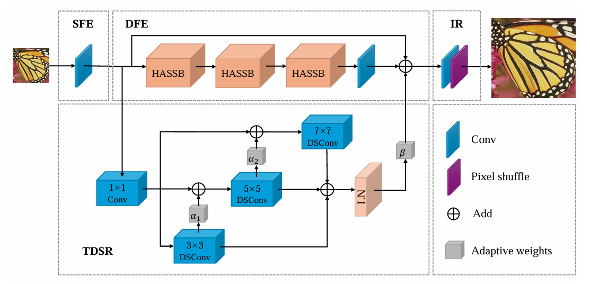

# Lightweight Image Super-Resolution Method Based on Mamba-Transformer Fusion Architecture
### This repository contains the code and pre-trained models for a paper submitted to The Journal of Supercomputing in April 2025, currently under review. More details will be added upon acceptance.


## Visual Results On MTSR


## Receptive Field


## Inference Speed


## Installation

The training experiment are conducted using PyTorch with two NVIDIA 4090 GPUs.

### 1. Configure Your Environment (Prerequisites)

- Ubuntu 22.04  
- Python 3.8  
- PyTorch 2.0.1  
- CUDA 11.7+  
- causal_conv1d 1.0.0  
- opencv-python  
- mamba_ssm 1.0.1  

> **Note:** It may also work with other versions.

### 2. Datasets

- Training Dataset: 
  - [DIV2K](https://data.vision.ee.ethz.ch/cvl/DIV2K/)
- Testing Datasets:  
  - [Set5, Set14, BSD100, Urban100](https://github.com/jbhuang0604/SelfExSR)  
  - [Manga109](http://www.manga109.org/)

## Create Environment

```bash
conda env create -f MTSR.yml
conda activate MTSR
```

## Pretrained Models

Pretrained models are available in the [Releases](https://github.com/xin1104/MTSR/releases/tag/v1.0).

## Training

- Cropped input size: 64×64  
- GPUs: 2  
- Batch size: 16 per GPU

```bash
python -m torch.distributed.launch --nproc_per_node=2 --master_port=1234 basicsr/train.py -opt options/train/train_MTSR_x2.yml --launcher pytorch
python -m torch.distributed.launch --nproc_per_node=2 --master_port=1234 basicsr/train.py -opt options/train/train_MTSR_x3.yml --launcher pytorch
python -m torch.distributed.launch --nproc_per_node=2 --master_port=1234 basicsr/train.py -opt options/train/train_MTSR_x4.yml --launcher pytorch
```

## Testing

```bash
python basicsr/test.py -opt options/test/test_MTSR_x2.yml
python basicsr/test.py -opt options/test/test_MTSR_x3.yml
python basicsr/test.py -opt options/test/test_MTSR_x4.yml
```

## License

This project is released under the **Apache 2.0** license.

## Acknowledgement

This project is based on [BasicSR](https://github.com/XPixelGroup/BasicSR) and [MambaIR](https://github.com/csguoh/MambaIR).  
Thanks to the authors for their outstanding contributions.
